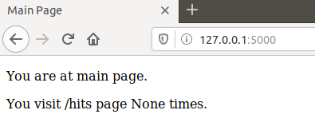
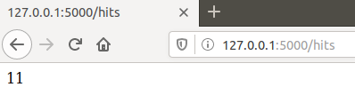
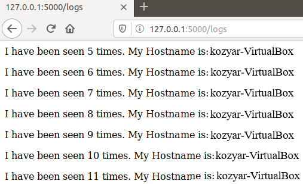

1. прочитав про докеркомпоуз
2. використовують flask
3. автоматизація за доп. Makefile vs docker-compose.yml
4. Варіант з Makefile
5. Створено папку `my_app`. Створено `tests`. Скопійовано файли репозиторію у відповідні папки. файл `requirements.txt` необхідний для встановлення бібліотек перечислених в ньому
6. проект працездатний
* тести не пройшли успішно, тому що необхідно щоб було встановлено додаткові утиліти і створена папка логів, але сервер працює
7. Почищено файли та додано `Dockerfile.app` та `Dockerfile.tests` та `Makefile`
8. директиви `Makefile`:
* Створюються змінні з назвами цілей
* з назвою репозиторію
* Описується хід дій для цілей `app` та `tests`
* `run` - запуск сервера та допоміжних контейнерів
* `test-app` - запуск контейнера з тестами 
* `docker-prune` - очищення контейнерів
9. Скріни сторінок:

10. Почистив ресурси
11. Створив директиву для завантаження імеджів: `make push`
12. Створив директиву для видалення імеджів `make clear`
13. створено docker-compose. дві мережі потрібно для взаємодії між контейнерами, до якої інші контейнери не мають мати доступу.
14. запустив docker-compose
15. Веб-сайт працює. потрібно зайти на локальну адресу комп'ютера з портом 80: localhost:80
16. змінено на власний репозиторій імеджі
17. Зупинено проект
18. Завантажено імеджі до хабу
19. Кому як зручніше. Звісно для роботи з докером практичніше буде використовувати docker-compose.yml - від дозволяє більш гнучким та коротшим способом налаштовувати контейнери. Але makefile також доволі сильний інструмент в автоматизації різних задач, тому тут вже по ситуації.
20. Створено docker-compose для 4-ї лабораторної роботи. docker-compose знаходиться у папці з 4-ю лабораторною